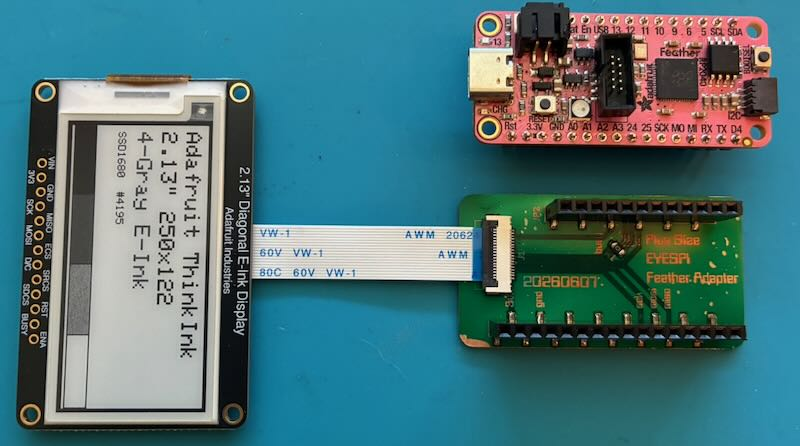
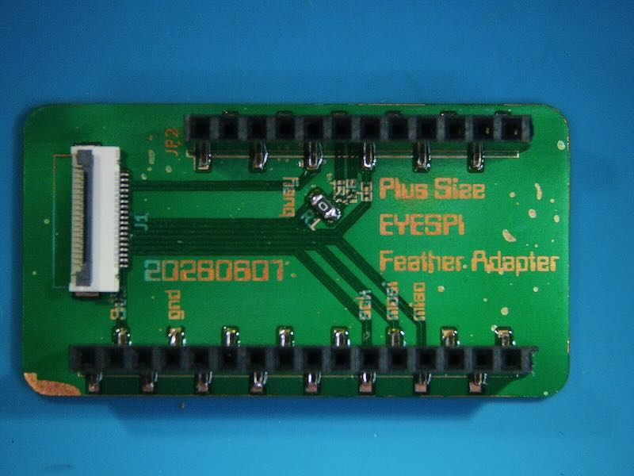
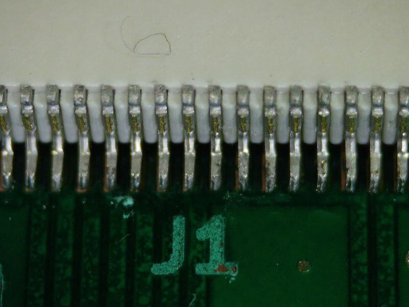
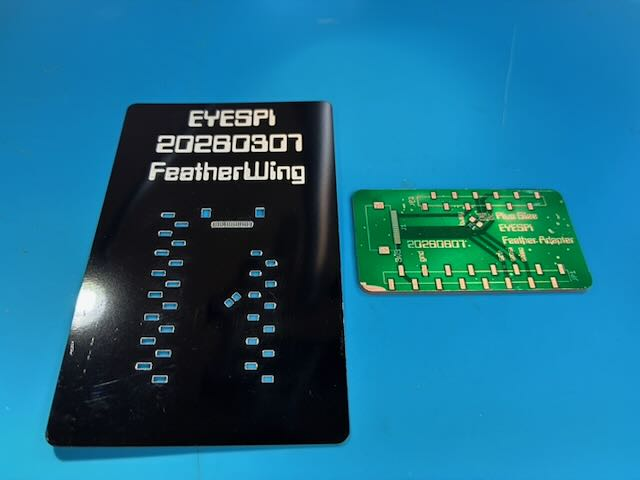
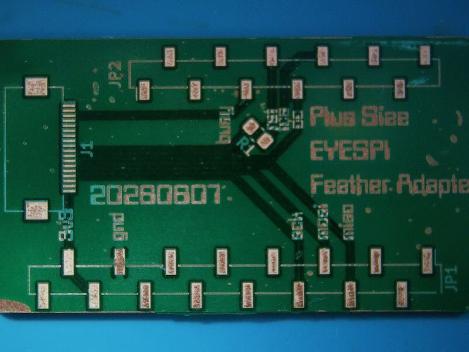
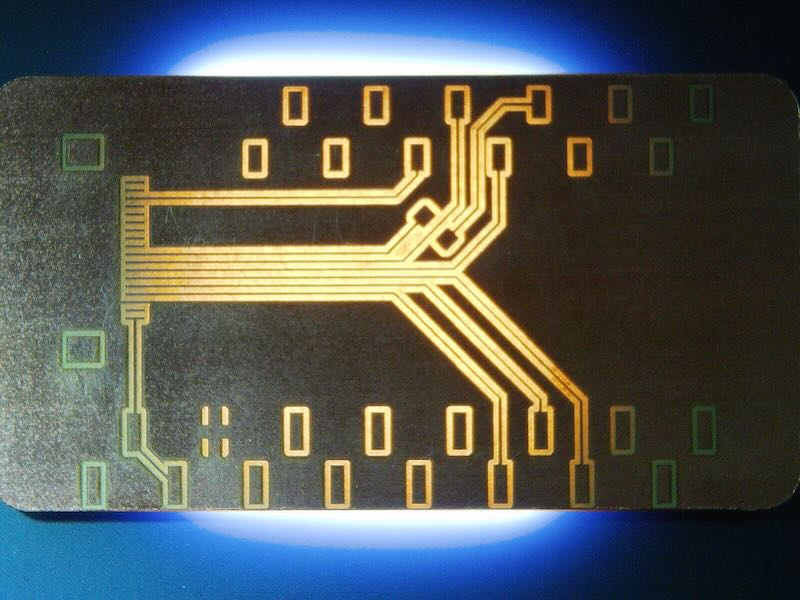
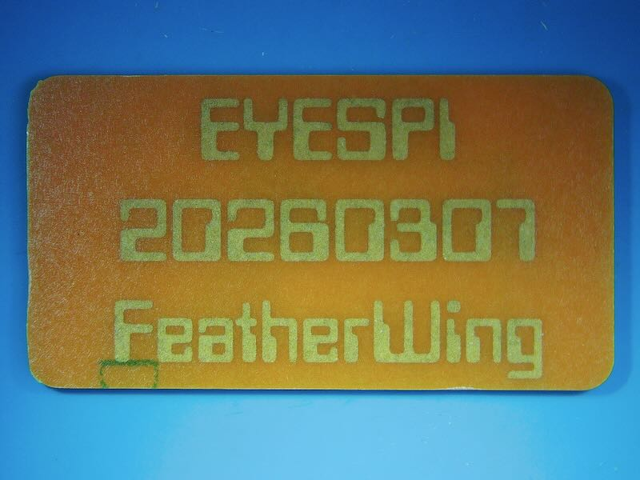
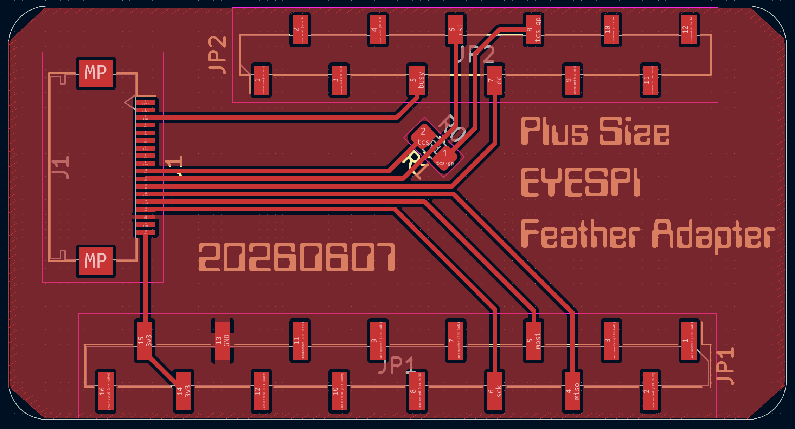

# feather-eyespi

A KiCad PCB design adding an EyeSPI display connector to an Adafruit Feather board.

## Assembly

### asm1 — Complete

<!-- Add description here -->

---

### asm2

<!-- Add description here -->

---

### asm3

<!-- Add description here -->

---

### asm4

<!-- Add description here -->

---

### asm5

<!-- Add description here -->

---

### asm6

<!-- Add description here -->

---

### asm7

<!-- Add description here -->

---

### asm8 — Design

<!-- Add description here -->

---

## License

This project is licensed under the GNU General Public License v3.0 — see the [LICENSE](LICENSE) file for details.
